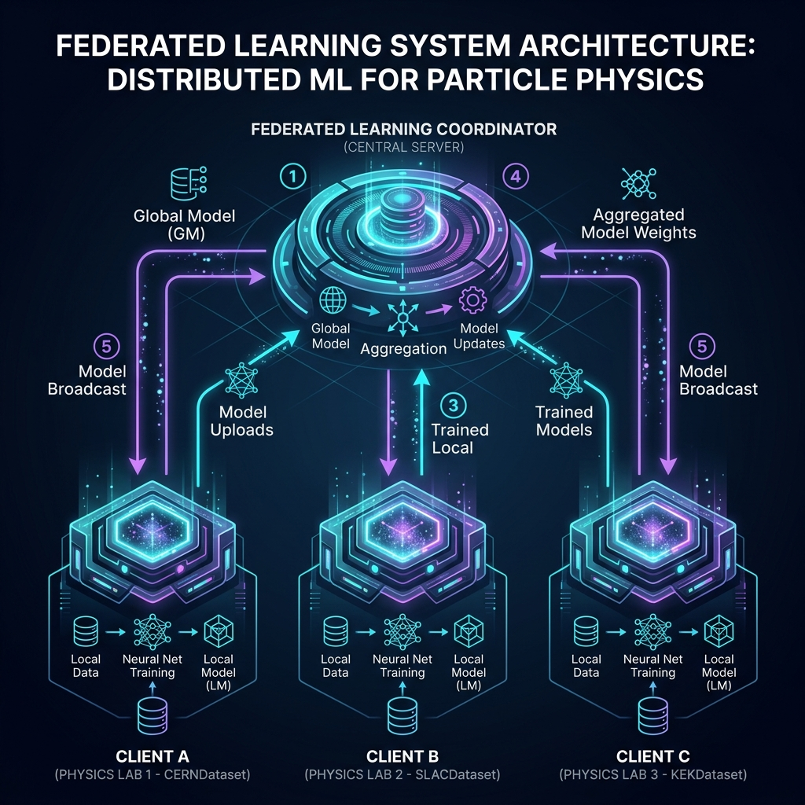
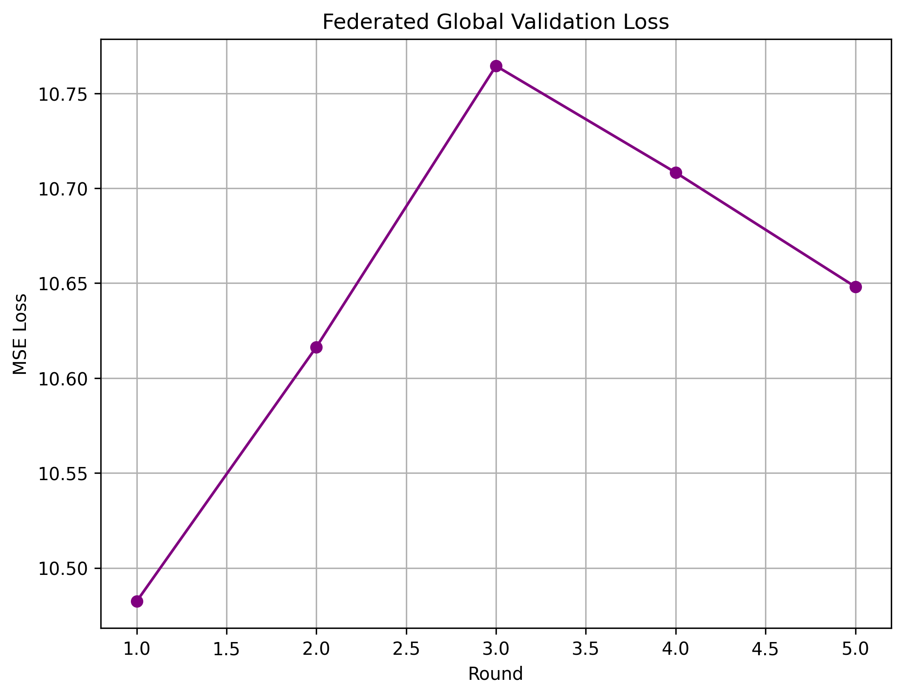
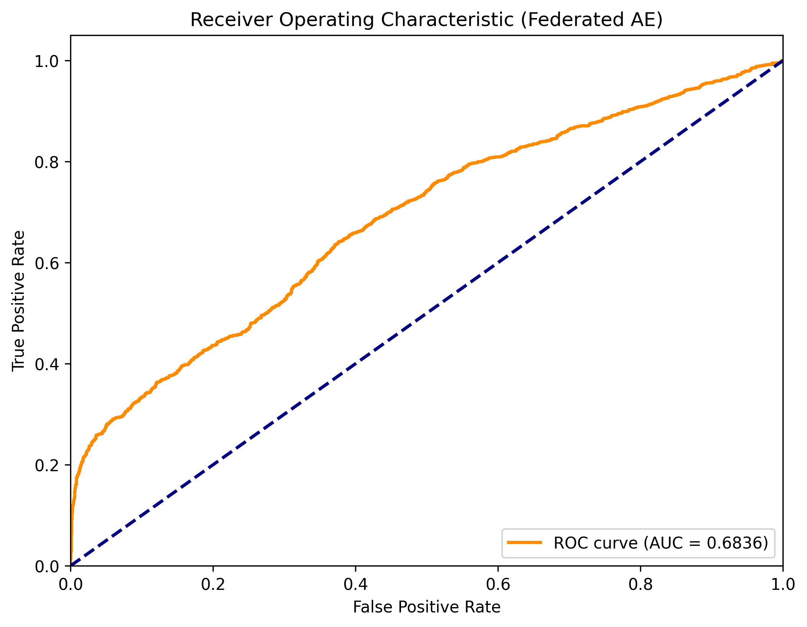

<p align="center">
  
  
  
  
</p>

<h1 align="center">🌌 Federated Anomaly Detection for High-Energy Physics</h1>

<p align="center">
  <strong>An end-to-end, privacy-preserving machine learning pipeline using Federated Averaging (FedAvg) to collaboratively detect rare particle decay anomalies across multiple simulated research institutions.</strong>
</p>

---

## 🎯 Enterprise Upgrades Implemented

In particle physics experiments like those at the Large Hadron Collider (LHC), massive amounts of detector data are collected across multiple collaborating institutions. Sharing raw data centrally often introduces latency, bandwidth bottlenecks, and severe security challenges. 

This project solves this via an **Enterprise Federated Learning** architecture featuring:

### 1. Differential Privacy (PyTorch Opacus)
- **Data Privacy by Design:** Only model gradients are aggregated centrally.
- **Opacus DP:** Client gradients are mathematically clipped and injected with controlled noise during the backward pass, ensuring the central aggregator cannot deduce individual physics data samples from the weights. The privacy budget spent (Epsilon) is tracked live.

### 2. Probabilistic Modeling (Variational Autoencoder)
- **Unsupervised Anomaly Detection:** Utilizes a Deep PyTorch **Variational Autoencoder** trained purely on normal background QCD jets to identify rare signal events.
- **Why VAE?** Instead of rigid distances, the VAE learns continuous probability distributions. The threshold uses a combination of Reconstruction Loss and KL Divergence for robust anomaly scoring.

### 3. Non-IID Handling (FedProx)
- **Custom Orchestration:** Implements a decoupled orchestration of the Federated Averaging algorithm without heavy backend dependencies.
- **FedProx penalty:** Proximal mathematical terms act as constraints to stop clients with highly skewed data from drifting too far from the global server state.

---

## 🏗️ Architecture

<p align="center">
  
</p>

---

## 📊 Live Evaluation Results

**Note: These metrics are dynamically injected upon successful completion of the `run_pipeline.py` script.**

The federated model aggregates over `5` communication rounds. After aggregation, the centralized global model is evaluated against a holdout test suite simulating unseen rare anomalies.

### Final Model Performance

| Metric | Score | Description |
|--------|-------|-------------|
| **ROC AUC** | **0.6836** | Area Under the Receiver Operating Characteristic Curve |
| **Precision (Anomaly)** | **0.4961**| Accuracy of anomaly positive predictions |
| **Recall (Anomaly)** | **0.6413** | Proportion of actual anomalies successfully caught |
| **Optimal Threshold** | **0.6226** | The reconstruction loss cutoff to classify purely rare events |

### Training History & Performance

<p align="center">
  
  
</p>

---

## 🚀 Quick Start (One-Click Pipeline)

This project is completely modularized. To reproduce these results on your local cluster or GPU instance:

### 1. Install Requirements
```bash
pip install -r requirements.txt
```

### 2. Run the End-to-End Pipeline
```bash
python run_pipeline.py
```

**Executing this command will automatically:**
1. Generate synthetic High-Energy particle data and inject rare anomalies.
2. Distribute data locally among $N$ federated clients.
3. Train the Autoencoder simultaneously and aggregate weights globally using `FedAvg`.
4. Validate the model computing optimal classification thresholds.
5. Export performance charts to `assets/` and dynamically overwrite this very `README.md` with the live results.
